# JBeam Forge

**Turn a 3D car model into a working BeamNG.drive mod without hand-writing a single line of jbeam.**

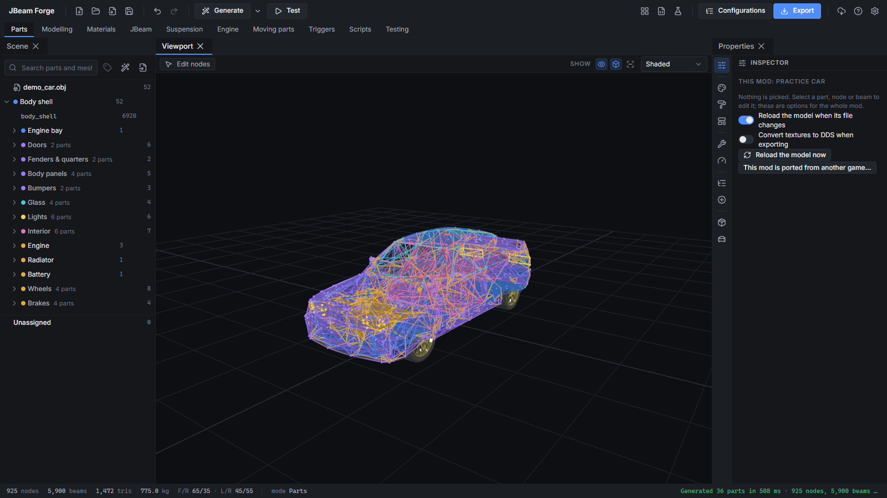

JBeam Forge is a Windows desktop app I built because I was sick of the gap between "I've got a nice model of a car" and "I've got a car that actually spawns in BeamNG." You bring the mesh. Forge sorts out the parts, builds the node and beam structure, lets you edit every bit of it, tests it in a little physics sandbox, and spits out a mod zip you can drop straight into your mods folder. Configs, preview images, tuning sliders, lights, skins, the lot.


---

## Contents

- [Why this exists](#why-this-exists)
- [What it does](#what-it-does)
- [Installing](#installing)
- [First launch](#first-launch)
- [Your first mod, start to finish](#your-first-mod-start-to-finish)
- [The features in detail](#the-features-in-detail)
- [Testing in-game](#testing-in-game)
- [File formats](#file-formats)
- [Keyboard shortcuts](#keyboard-shortcuts)
- [Troubleshooting](#troubleshooting)
- [FAQ](#faq)
- [Building from source](#building-from-source)
- [Credits](#credits)

---

## Why this exists

If you've ever tried to make a BeamNG car from scratch, you know how it goes. You spend a weekend placing nodes by hand in a text file, the car spawns as a cloud of floating triangles, the log says something useless, and you find out three days later that a field name was wrong the whole time.

Forge takes the tedious and error-prone parts off your plate:

- It works out what each mesh is from its name and puts it in the right slot.
- It builds the physics skeleton from a simplified version of each part's shape, which is how the official cars are built anyway.
- It writes jbeam the way BeamNG's own vehicles are written. Every format it outputs was checked against a real official vehicle, not guessed from memory or forum posts.
- It refuses to export stuff that's going to be broken in-game, and it tells you why.

It's not magic. You'll still be tuning things and testing in the game. But you'll be tuning a car that works, instead of trying to get a car to exist at all.

---

## What it does

The short version:

| Area | What you get |
|---|---|
| **Import** | DAE, FBX, OBJ, glTF/GLB and STL. Split merged models into parts without wrecking UVs. |
| **Part sorting** | Auto-detects parts from mesh names, puts them in a proper parent/child tree, and lets you fix anything it gets wrong with dropdowns. |
| **Per-part details** | Display name, price, description, mass, slot, parent part, construction material, variants. |
| **Structure generation** | Builds low-poly proxies per part and turns them into nodes, beams and collision triangles, with bracing and symmetry. |
| **Editor** | Full node/beam/triangle editing with soft-move, symmetry, undo that survives saving, and a focus mode for working on one part at a time. |
| **Physics sandbox** | Drop tests, crash obstacles, stress heatmaps and an instant "is this going to explode" predictor. |
| **Materials** | Proper PBR preview, a material editor, a library of presets, paint slots, and access to the game's own shared materials and wheels. |
| **Hinges** | Guided wizard for doors, bonnets and boots, with a live swing preview, latches and handles. |
| **Suspension** | Builds from your own suspension meshes or from kits. Multiple setups per axle, brakes, steering racks and subframes. |
| **Powertrain** | Engine designer with a draggable dyno chart, turbos, gearboxes, diffs, transfer cases, EVs, exhausts, cooling and nitrous. |
| **Extras** | Cameras, animated props (steering wheel, pedals, gauge needles), lights with damage, breakable glass, aero, skins, a tow hitch and global tuning controls. |
| **In-game tuning** | Mark any number as tunable and it turns up in BeamNG's Tuning menu. |
| **Configs** | Build multiple configurations with inheritance, live price/weight/power totals and auto-captured preview images. |
| **Export & publish** | One click to a validated mod zip (textures as DDS if you like), plus a publish checklist for the repository. |
| **JBeam workspace** | Tables of nodes, beams and triangles with exact values and every jbeam property, logical renaming, bulk edits and checks. |
| **More mod kinds** | Engines for the game's cars, universal tyres and wheels, and new body panels (hoods, bumpers, doors, spoilers…) for the game's cars on their stock physics, each with its own builder. |
| **Skins** | A Skin studio that unwraps the body like a skin template (every panel in place, one scale), saves PNG/SVG templates to paint, and turns the painted one into an in-game paint design. |
| **Live model** | Save the model again in Blender and Forge reloads it, keeping your parts, materials and structure. |
| **Help** | A first-run tour on a practice car, and a help centre with worked examples. |
| **Extensions** | Add your own commands and importers (docs/extensions.md); a BeamNG vehicle importer and a CMS 2021 importer come as examples. Ported mods must credit the game and be free. |

---

## Installing

1. Grab the latest installer (or the portable exe if you don't want to install anything) from the [Releases](../../releases) page.
2. Run it. Windows SmartScreen may complain because the exe isn't signed. Click **More info → Run anyway**.
3. That's it. No Python, no Blender, no extra runtimes.

**Requirements**
- Windows 10 or 11, 64-bit
- A GPU that can handle WebGL 2 (anything from the last ten years is fine)
- BeamNG.drive installed. Forge reads the game's own content for reference formats, shared materials, wheels and engine sounds. It never modifies your game files.

---

## First launch

Forge asks you two things the first time you open it, and then never again:

1. **Your BeamNG install folder.** This is the folder with `BeamNG.drive.exe` in it. If you own it on Steam, it's usually under `steamapps\common\BeamNG.drive`.
2. **Your author name.** This goes into every mod's info file. Put your modding username here, not your real name, unless you want your real name on the repo.

You can change both later in **Settings**.

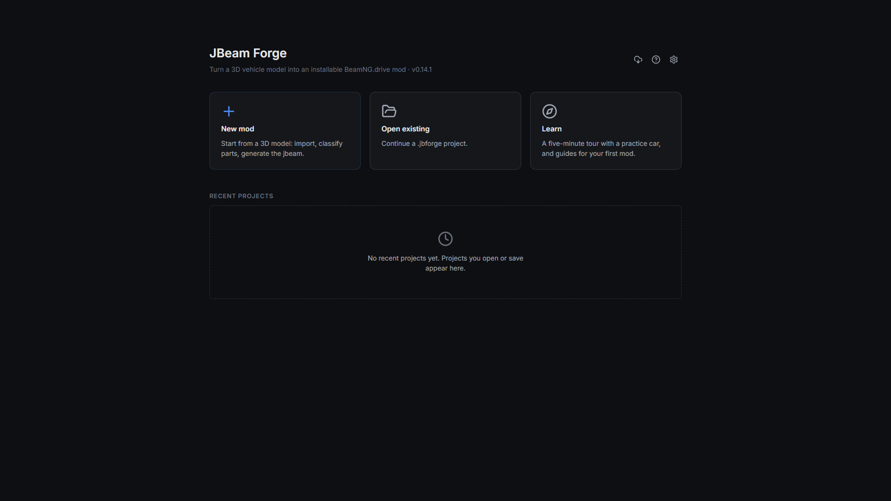

After that you land on the home screen: **New Mod**, **Open Existing**, **Learn**, and your recent projects with thumbnails. The very first time, a short tour on a practice car shows you around; skip it whenever you like and replay it from **Learn**.

---

## Your first mod, start to finish

This is the full loop. Each step is covered in more detail further down.

### 1. Create the project
Click **New Mod** and fill in:
- **Vehicle name.** The display name, e.g. `Moyle Rigger GT`.
- **Slug.** This gets filled in from the name (`moyle_rigger_gt`). It's the folder name BeamNG uses, so it has to be lowercase with underscores only. Forge won't let you save a bad one.
- **Description, brand and type.**
- **Initial mesh** (optional). You can also import later.

This saves a `.jbforge` project file. Everything you do lives in that one file.

### 2. Import your model
**File → Import** and pick your mesh. A few notes:
- **DAE** is the native format and the safest bet.
- **glTF/GLB** gives the cleanest material mapping of the lot. If you're exporting out of Blender, it's worth using.
- **FBX** units are all over the place, so you get a scale dialog with a live bounding box readout and cm/inch presets. If your car is 450 metres long, this is where you fix it.
- **STL** has no UVs or materials, so it comes in as one mesh with a default material. The UV tools can rescue it.

If textures are missing, Forge asks you to point it at the folder instead of silently leaving them blank.

### 3. Sort out the parts
Forge reads your mesh names and classifies everything it can. You get a summary showing what it detected and what's left unassigned.

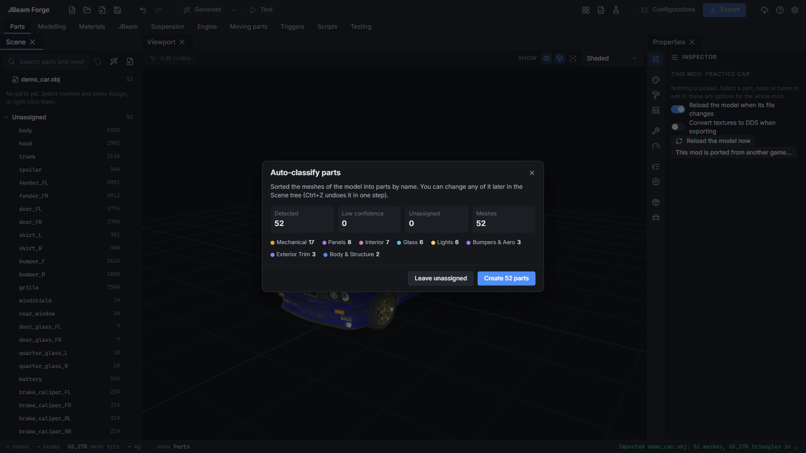

The detection handles real-world naming, including typos. `Driveline_Axel_Boot_Inner_Rear` still ends up as a rear inner axle boot. For best results, name your meshes like this:

```
Category_Part_Position_Variant
Body_Door_FL
Glass_Door_FL
Bumper_Front_Sport
```

There's a full naming guide in [`docs/part-naming-conventions.md`](docs/part-naming-conventions.md).

For anything unassigned or wrong, click the part and either:
- type into the **search box** (it fuzzy-matches across everything), or
- use the **cascading dropdown**: Category → Sub-category → Part → Position.

You can bulk-assign as well. Select four door glasses, assign them as "door glass" in one go, and Forge sorts out FL/FR/RL/RR from where they sit on the car.

If your model is one big merged lump, split it first (see [Mesh splitting](#mesh-splitting)).

### 4. Fill in the part details
Every part has a details panel:

- **In-game name**, **price** and **description**. These show up in BeamNG's parts menu.
- **Mass (kg).** This comes pre-filled from the part type and material. Override it if you know the real figure, and hit reset to go back to the default.
- **Slot**, picked from a dropdown of valid slots, and **parent part**, e.g. the door glass belongs to the front-left door. Forge won't let you create a loop where a part ends up being its own grandparent.
- **Construction material**: Steel, Aluminium, Carbon, Fibreglass or Plastic. This changes the default mass and how stiff and breakable the part is.

Want a second bumper option? Right-click → **Duplicate as variant**. Variants share a slot, so they're swappable in the parts menu in-game.

### 5. Generate the structure
Hit **Generate**. For every part, Forge builds a simplified low-poly shell hugging its shape, then turns:
- shell corners into **nodes**
- shell edges into **beams**
- shell faces into **collision triangles**

It also adds internal bracing, because a bare shell is about as rigid as a chip packet. It attaches each part to its parent using the attachment style you pick (bolted, clipped, welded or riveted). The reference nodes BeamNG needs are placed automatically.

A whole car usually lands somewhere around 600 to 1,200 nodes. The status bar always shows your live node, beam and triangle counts and total mass.

### 6. Check it in the sandbox
Switch to **Test** and hit **Settle**. If the car sits there looking like a car, you're in good shape. If something's going to explode, the stability checker usually tells you before you even run anything, and it tells you which node and what to change.

### 7. Doors, suspension, engine
Run the **Hinges** wizard for anything that opens, the **Suspension** wizard per axle, and set up an engine and gearbox in **Powertrain**. They're all covered below.

### 8. Materials and configs
Tidy up materials, set paint slots, and build your configurations (base, sport, drift, whatever you like). Capture preview images for each.

### 9. Export
Click **Export**. Forge runs the validator, builds the whole mod folder, and zips it. Drop the zip in your BeamNG `mods` folder, spawn it, and read [Testing in-game](#testing-in-game).

---

## The features in detail

### Mesh splitting
For models that come in as one mesh. Splitting is non-destructive: it records which faces belong to which part, so your UVs and materials stay intact and you can undo it.

- **Split by connected pieces.** One click, and anything not physically joined becomes its own part. This sorts out most models.
- **Face selection.** Paint, lasso or box select faces, or flood-fill with an angle limit so it stops at hard edges.
- **Plane cut.** Drag a plane through the model and cut along it.

Split and non-DAE models are converted back to DAE on export with UVs, normals and materials intact.

### The scene tree
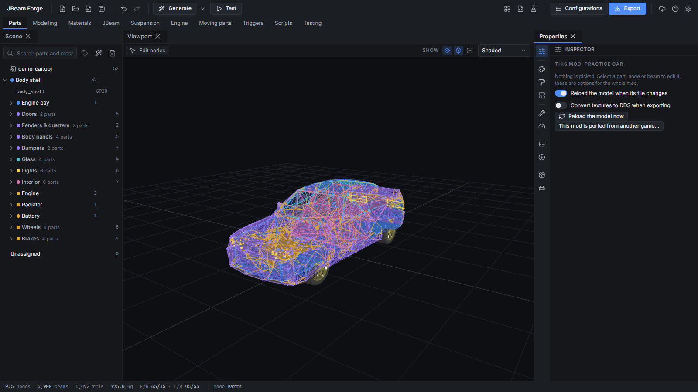

The tree is an actual hierarchy starting from the body. Doors sit under the body, and door glass, door cards, handles, mirrors and window switches sit under their door. You can:
- drag parts to reparent them
- search, and the tree expands to show the matches
- click in the viewport to find a part in the tree, or the other way round
- see per-branch part counts and category colours at a glance

Ignored meshes are greyed out at the bottom of their branch.

### Structure generation settings
Each part type gets a sensible proxy mode by default. You can override it:

- **Decimate.** Simplifies the actual shape. Used for panels, body, glass and trim.
- **Convex hull.** A shrink-wrapped outer shell. Used for engines, gearboxes, diffs and hubs.
- **Primitive fit.** A best-fit box or cylinder. Used for driveshafts and suspension arms.

Other controls:
- **Detail slider** with live vertex, triangle and estimated beam counts
- **Minimum feature size**, so tiny bits don't get their own nodes
- **Shell offset**, which pulls the shell slightly inside the visual mesh
- **Symmetry.** Builds one half and mirrors it, so left and right node pairs match exactly.
- **Bracing density**: none, light, standard or heavy

The cleanup pass welds duplicate points, removes slivers, splits beams that are too long (floppy) and collapses ones that are too short (unstable). You don't have to think about any of that unless you want to.

### Editing
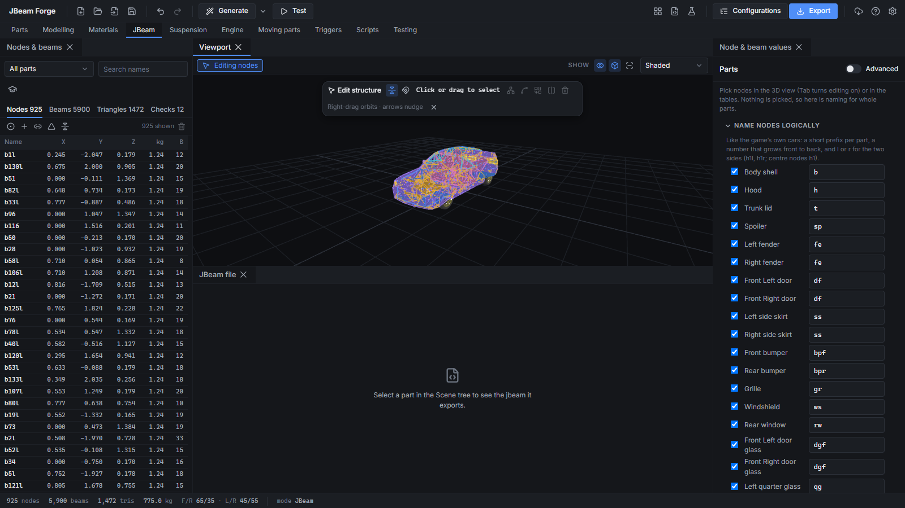

This is where most of your time goes, so I put the most work into it.

**Selecting.** Click, box, lasso, select connected, select a whole part, invert. Hold Shift to add and Ctrl to remove. Save selections as named sets for later.

**Moving.** Use the gizmo, type exact numbers, or nudge with the arrow keys. Snap to grid or to the mesh surface. Symmetry is on by default, so moving a left node moves its right partner, and you can break a pair apart when you need to.

**Soft-move** is the one you'll use constantly. Move a node and everything within a falloff radius comes along, easing off with distance. It's the fastest way to shape a panel.

**Topology.** Add nodes on a surface, on a plane or at a beam midpoint. Delete nodes (orphaned beams get cleaned up). Merge nodes, draw chains of beams, delete beams, and add, delete or flip triangles.

**Properties.** Weight, node ID, friction, node material and collision per node. Beam preset plus per-beam overrides. Select a bunch of things and edit them all at once. Renaming a node updates every reference to it everywhere.

**Bulk tools.** Scale or rotate around the centre of the selection, align to an axis or plane, and evenly redistribute nodes.

**Regenerating** a part keeps any nodes you've moved by hand.

**Undo/redo** is unlimited, and it survives saving and reopening the project.

**Also:** camera bookmarks, X-ray mode, mesh opacity, a measuring tool, and a shortcut cheat sheet.

#### Focus mode
Double-click a part, press **F**, or click the focus icon in the tree. The camera glides to the part, everything else fades to a ghost, and the inspector turns into that part's page: variants, details, generation, attachment, hinges, aero, materials and validation all in one place. Press **Esc** or double-click empty space to leave, or double-click another part to jump straight to it.

### Physics sandbox
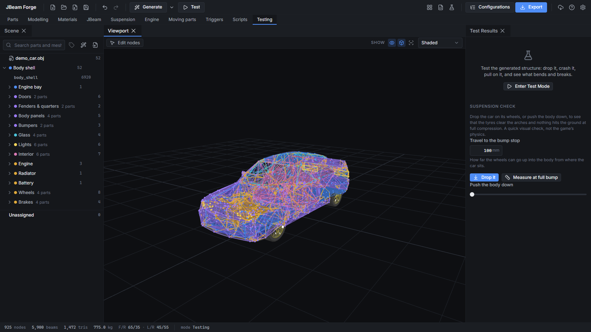

The sandbox runs its own soft-body solver at 2000 Hz. It uses the same spring and damping values the export writes, so what you see here is a reasonable preview of the structure.

**Before you even run it**, the static checks flag:
- orphan nodes and nodes barely connected to anything
- parts of the car that aren't connected to the rest
- zero-length and duplicate beams
- nodes that are going to explode, predicted from mass vs beam stiffness. You get a message like "node `dl4r` is 0.2 kg with ~4M beams, add mass or soften" instead of finding out the hard way.

**Live mode.** Grab and drag nodes with the mouse, toggle gravity, open doors by hand, pause and slow-mo.

**One-click scenarios:**
- **Settle.** Shows a sag heatmap.
- **1 m drop** and **20° corner drop**
- **Suspension drop.** Shows ride height and sag per corner.
- **Hinge swing.** Does the door open within its limits and stay attached?
- **Attachment yank.** Does the part come off where it should, instead of tearing randomly?
- **Crash obstacles.** Side pole, frontal wall and 40% offset barrier, with a live beam stress heatmap that holds the peak values.

Broken beams and unstable nodes are listed in the results panel. Click one to jump to it. Resetting puts everything back exactly as it was, because the sim never touches your actual project data.

> **Heads up:** this is not BeamNG's solver. It's very good at telling you whether the structure is stable, stiff enough and breaks in the right places. How it drives and how it crumples in a real crash still gets finalised in-game. The app says this on screen too, because it matters.

### Materials
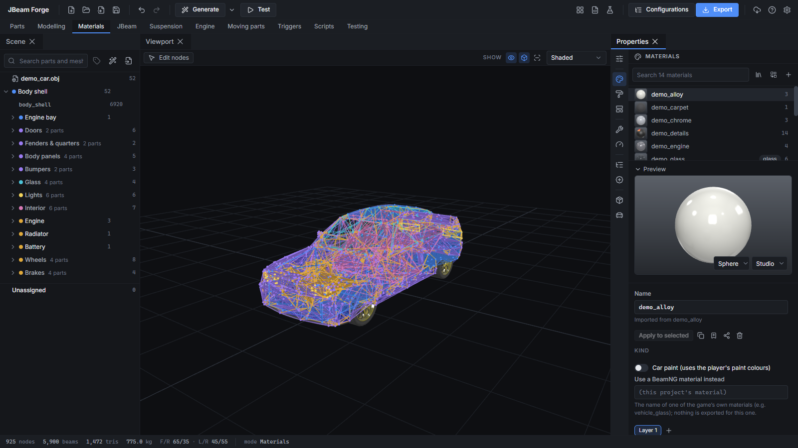

**Preview.** Studio lighting with proper metallic, roughness, clearcoat, normal, AO and emissive rendering. You can switch the viewport to show just base colour, roughness, metallic, normals, AO or a UV checker.

**Editor.** One scrolling list of properties per material, grouped sensibly. Sliders with number boxes, and a picker for every texture slot (PNG, JPG and DDS) with thumbnails. Changes show up in the viewport straight away.

**Paint.** Set up the paintable areas and the three paint slots, each with colour, metallic, roughness and clearcoat, so your car works with BeamNG's paint picker.

**Drag and drop** a material onto a mesh in the viewport or onto a row in the tree.

**Merge.** Imported models love having `Chrome`, `Chrome.001` and `Chrome_02` that are all the same material. The merge tool finds these, shows them side by side, and merges them in one go.

**Library.** Save materials to your personal library for reuse across projects. It ships with 30-odd presets: paints, plastics, metals, glass, rubber, fabric and leather, and carbon fibre. Share materials with other people as `.jbmat` files.

**Game materials.** Use BeamNG's own shared glass, chrome, rubber, number plates and so on by name, without copying their textures into your mod. There's also a **wheel picker** for the game's own wheels, per axle or per corner.

**UVs.** View UV islands over the texture, auto-unwrap models with bad or missing UVs, use box, planar or cylinder projection, and bake ambient occlusion.

### Hinges and latches
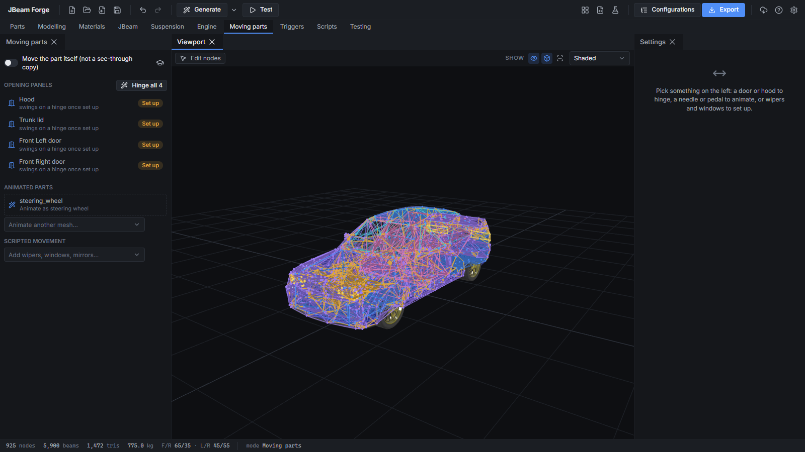

1. Enter hinge mode and click the door, bonnet or boot.
2. Let Forge find the hinge axis from the closest edge, or click two points yourself. Both points stay draggable.
3. The part **swings open and closed in the viewport on a loop** so you can see straight away whether the axis is right. Use the slider to set how far it opens.
4. Click where the latch goes.
5. Click the handle positions (outside and inside) so you can open it on foot in-game.
6. Confirm.

Forge generates the hinge beams, the opening limit and a latch that pops open under a big enough hit. Per door, you can tweak hinge stiffness and damping, opening angle, latch strength and auto-latching.

### Suspension
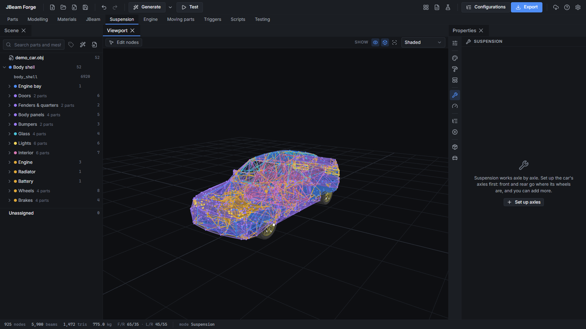

**From your own meshes.** If your model has control arms, hubs, coilovers, driveshafts and a diff, and they're named sensibly, Forge uses them. Pivot points come from the ends of the arms and hub centres from the hubs, and each mesh is bound to its own nodes, so they move properly in-game.

**From kits.** For anything missing, pick a kit per axle: MacPherson strut, double wishbone, solid axle with coils, or solid axle with leaf springs. Click the mount points (the other side mirrors automatically) and you're done. Kits come with placeholder geometry, and there's a placeholder wheel, so a body-only model can still drive.

You can mix both approaches. A per-corner checklist shows what's from your mesh ✓, what's from a kit ⚙, and what's missing ✗.

**Tuning per setup:** spring and damping (bump and rebound), ride height, travel, caster, camber, toe, track width, steering lock and ratio, anti-roll bars, tyre size and pressure. Presets for Comfort, Sport, Drift, Rally and Race get you in the ballpark.

**Multiple setups per axle.** Make a "Double Wishbone" and a "DW Drift" and both show up as options in the parts menu. Trucks with three or four axles work too, with each axle set as steered and/or driven.

**Also:** brakes per axle (disc or drum, size, torque, bias, handbrake, heat) as swappable parts, steering racks as parts, and front and rear subframes that the suspension and engine bolt to. Subframes can break away from the body in a big enough crash.

### Powertrain
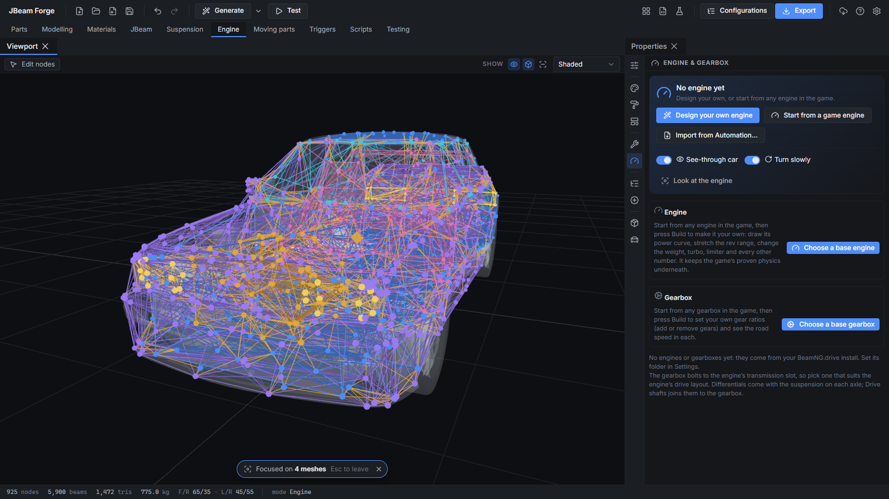

**Engine designer.** Start from a preset (inline 3 through V12, boxer, rotary or diesel), then adjust displacement, idle, redline, inertia, friction and fuel. The **dyno chart** is the fun bit. Drag the torque curve points around and watch the power curve (kW and hp) update live, with peak numbers called out. Add a **turbo** and the boost curve overlays against the naturally aspirated one, so you can actually see spool, wastegate and max pressure. There's a supercharger option too.

**Drivetrain parts:**
- Gearboxes: manual, auto, sequential, DCT and CVT, with a **speed-per-gear chart** calculated from your tyre size
- Clutch and torque converter
- Transfer cases: part-time or full-time, low range, centre diff and locking
- FWD, RWD, AWD and 4WD layouts
- Diffs with every setting (preload, power/coast lock, viscous, final drive) plus presets for Open, Welded, 1.5-way, 2-way, Viscous and Torsen-style
- Electric motors with their own dyno chart and regen, for EVs and hybrids
- Exhaust chains (manifold → downpipe → mid → muffler) with variants and sound muffling
- Cooling: radiator, fan, thermostat, oil pan and oil cooler
- **Nitrous** as a bolt-on

**Meshes and variants.** Every component can have its own mesh. Make "Turbo Stage 1/2/3" as variants, each with its own specs *and* its own turbo mesh, and they're all selectable in-game.

**Engine sound.** Pick from the game's own engine sounds with a filterable list.

The sandbox doesn't simulate the powertrain, so the dyno chart is your preview there.

### Cameras and animated props
**Cameras.** Driver, passenger, bonnet, roof, front and rear bumper, or custom. Click to place, set the field of view, and preview the view from that camera without leaving the app.

**Animated props.** Pick any mesh, click its pivot and axis, and hook it up to something:
- steering wheel (±450°)
- throttle, brake and clutch pedals
- gear shifter
- wipers
- **gauge needles** (speedo, tacho, fuel and temp, with range mapping). This is what makes a scratch-built interior feel alive.
- engine-speed items like fans and pulleys
- wheel-speed items

Drag the preview slider to check it moves right before you commit.

### Lights, glass, aero, skins and the rest
- **Lights.** Tell Forge which light is which (low and high beam, DRL, fog, brake, tail, reverse, indicators, plate, interior) and it sets up the glowing materials and wiring. Smash a corner and that light dies. There's a quick popover to test each light in the app.
- **Number plate.** Uses the game's standard plate slot.
- **Breakable glass.** Set a break force per window and it shatters the way the stock cars do.
- **Aero.** Downforce for wings, splitters and diffusers, with a side-view display of where the downforce acts.
- **Skins.** Set up named skins, pick a skin per config, and export a **livery template**: a labelled PNG of your UV layout at 2K or 4K. Paint it in whatever you like and bring it back in as a skin.
- **Tow hitch.** Places the standard game coupler so you can tow the official trailers. Recovery points too.
- **ABS** settings on the brakes.
- **Global controls.** Set a target total weight and everything scales proportionally, apart from parts you've locked. There are also global multipliers for stiffness, springs, damping, deformation and strength. None of this touches your actual values; it's applied at export, and you can see the effective numbers and reset any time.

### In-game tuning sliders
Most number fields have a small **tunable** toggle. Turn it on and that value becomes a slider in BeamNG's Tuning menu, with a sensible range, units and category worked out for you. The suspension and turbo wizards switch on the usual suspects by default, so every mod you export is tuner-friendly out of the box. Rename them, adjust ranges or turn them off in the **Variables** panel.

### Configs
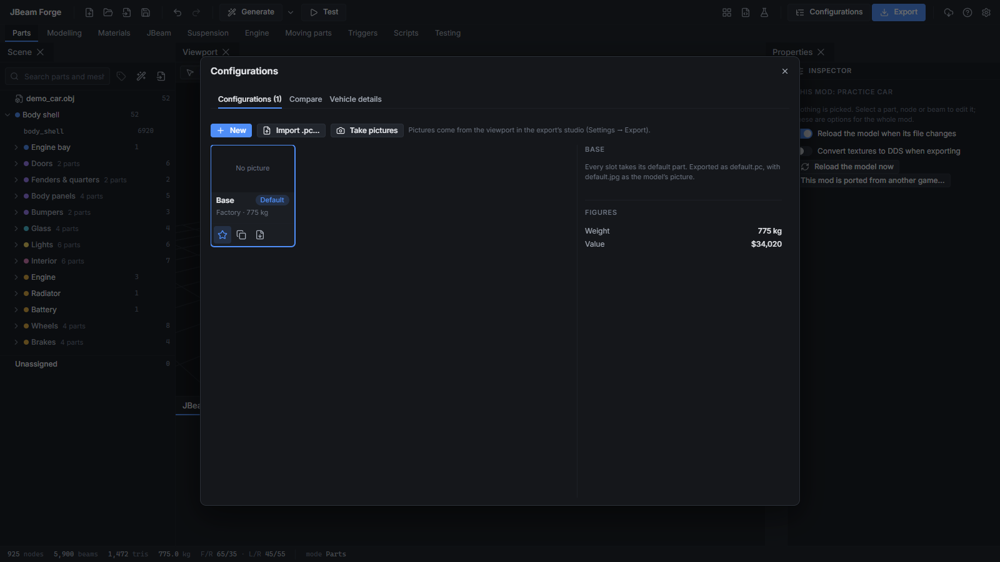

- Build each config by picking parts slot by slot. Each option shows its name, price and weight difference.
- **Live totals** for price, weight, power and power-to-weight.
- **Inheritance.** Make a base config and have "Sport" and "Drift" only override what's different. Change the base and the others follow. Overridden slots are marked and can be reverted one at a time.
- Set paint, skin and tuning values per config.
- **Compare** two configs side by side.
- Pick a config from the toolbar and the viewport shows exactly that build.
- **Preview images.** Captures white-studio previews framed and named the way the game expects, one at a time or all at once, plus a contact sheet.

### Power tools
- **Live jbeam preview.** Shows the actual jbeam text for the selected part, updating as you edit. Handy for learning, and for trusting that the app is doing what you think it's doing.
- **Mass and balance overlay.** Centre of gravity marker, front/rear and left/right weight split, and a per-part mass heatmap. Updates live.
- **Blueprint underlay.** Load side, top and front reference images and calibrate the scale with two clicks.
- **Command palette** (**Ctrl+K**). Type a part name to focus it, or find any panel or action.
- **Part packages** (`.jbpart`). Export a part with its meshes, materials and settings and drop it into another project, or share it.

### Export and publishing
**Export** builds the complete `vehicles/<your_slug>/` folder:
- jbeam files per part (nodes, beams, triangles, flexbodies, slots, tuning variables, props, cameras and so on)
- the DAE with final mesh names
- materials file and textures
- info file
- a `.pc` file and preview image per config
- a thumbnail

...and zips it. There's also a loose-files export under Advanced if you want to poke at things by hand.

**The validator** won't let you export things that are guaranteed to break in-game, like a part without a flexbody (invisible part), a flexbody pointing at a mesh that isn't in the DAE, nodes without a group, slots pointing at nothing, missing reference nodes or missing textures. Everything else comes up as a warning you can choose to ignore. It'll also offer to run a quick settle test before exporting.

**Publish panel.** Set tags, version and changelog, manage the icon, and bump the version into the info file. Then run the pre-publish checklist (validation passed, every config has a preview, no placeholder parts left, zip size OK, the final zip actually parses) and get a repository-ready zip plus a description you can paste straight into the upload page.

### Bringing in existing mods
**Open → Import from mod folder** reads an existing BeamNG mod back into a Forge project. It's best-effort. The format is loose and people do creative things with it, so you'll get warnings for anything it couldn't understand. Anything exported from Forge comes back in fully editable.

---

## Testing in-game

Nothing beats spawning the car. My loop looks like this:

1. **Export** the mod zip.
2. Open your BeamNG user folder (the launcher can open it for you) and drop the zip into the `mods` folder. Replace the old one if you've exported before.
3. Launch the game and spawn the car.
4. If something's off, open `beamng.log` in the user folder, find the errors that mention your mod, and fix them in Forge.
5. Repeat.

**Things to check on a first spawn:**
- Does it spawn and is it visible?
- Does it sit on its wheels without exploding or sagging?
- Does the parts menu show your parts and variants?
- Do doors open and latch?
- Do the Tuning menu sliders show up?

There's a longer checklist in [`docs/testing-in-beamng.md`](docs/testing-in-beamng.md).

---

## File formats

| File | What it is |
|---|---|
| `.jbforge` | Your project. Everything lives in here. Old project files are upgraded automatically when you open them in a newer version. |
| `.jbmat` | A shareable material with its textures bundled in. |
| `.jbkit` | A suspension kit template. Drop your own in to add new suspension types without touching any code. |
| `.jbpart` | A shareable part: meshes, materials, settings and variants. |

Settings are layered. The app's built-in defaults are overridden by your personal settings, and those are overridden by the project's settings. So you can, say, add your own custom part types once and have them show up in every project.

---

## Keyboard shortcuts

| Key | Does |
|---|---|
| **Ctrl+K** | Command palette |
| **F** | Focus the selected part |
| **Esc** | Leave focus mode / cancel |
| **Ctrl+Z / Ctrl+Y** | Undo / redo |
| **Arrow keys** | Nudge selection |
| **Shift + click** | Add to selection |
| **Ctrl + click** | Remove from selection |
| **Ctrl+S** | Save |

The full list is under **Help → Keyboard Shortcuts**.

---

## Troubleshooting

**The car is invisible in-game.**
Almost always a flexbody problem, meaning the jbeam and the DAE disagree on a mesh name. The validator should have caught this. If it didn't, please open an issue with your `beamng.log`, because that's a bug.

**The car explodes on spawn.**
Run the static checks in Test mode. It's usually a very light node attached to very stiff beams. The stability checker will name the node and tell you whether to add mass or soften the beams.

**The model imported at the wrong size.**
It's an FBX, isn't it? Re-import and use the scale dialog. The bounding box readout will tell you if your car is 4.5 m or 450 m long.

**A panel went blank or shows an error card.**
That panel crashed, but the rest of the app is fine. Click **Copy diagnostics** and include it in a bug report, then **Reload** or **Reset layout**.

**Something else broke.**
Go to **Help → Open Log Folder** and grab the latest log, or use **Help → Copy Diagnostic Info**, and open an issue with it. The more detail, the faster I can fix it.

---

## FAQ

**Why isn't this a Blender addon?**
I thought about it a lot. A Blender version would lose the physics sandbox, the dyno charts, the wizards, the dockable layout and the game content integration. It would also be competing with BeamNG's own official Blender jbeam addon, which is good at what it does. Forge is a different kind of tool. Model your car in Blender, then bring it here to make it a car.

**Is the sandbox as good as testing in BeamNG?**
No, and it doesn't pretend to be. It's great for catching structural problems in seconds instead of relaunching the game. Final handling and crash behaviour still need testing in-game.

**Do I need to know how jbeam works?**
Not to get a car working. It helps when you want to get fancy, and the live jbeam preview is a good way to learn by watching what changes as you edit.

**Can I sell or upload mods made with this?**
They're your mods. Just make sure you've got the rights to the model you started with.

**Does it change my BeamNG install?**
No. It only reads from the game folder. Everything it makes goes into your project and your export.

**Mac or Linux?**
Windows only for now.

---

## Building from source

You'll need Node.js (LTS) and git.

```bash
git clone https://github.com/Connor-Moyle/jbeam-forge.git
cd jbeam-forge
npm install
npm run dev
```

Other useful commands:

```bash
npm test               # run the test suite
npm run typecheck      # TypeScript checks
npm run lint           # lint
npm run bench:solver   # physics solver benchmark
npm run study-vehicle  # extract an official vehicle for format reference
npm run dist           # build the Windows installer and portable exe
```

Built with Electron, React, TypeScript and Vite, with three.js for the viewport and the physics solver running in its own worker thread. If you're contributing, have a read of `docs/` first. The BeamNG format notes in there were all checked against official vehicles, and they're the source of truth over anything you remember from a forum post.

Bug reports, feature requests and pull requests are all welcome. For bigger changes, open an issue first so we can have a yarn about it before you sink a weekend into it.

---

## Credits

Built on the shoulders of some great open-source projects:
[three.js](https://threejs.org), [three-mesh-bvh](https://github.com/gkjohnson/three-mesh-bvh), [meshoptimizer](https://github.com/zeux/meshoptimizer), [xatlas](https://github.com/jpcy/xatlas), [dockview](https://dockview.dev), [Zustand](https://github.com/pmndrs/zustand), [electron-log](https://github.com/megahertz/electron-log), [Lucide](https://lucide.dev) and the [Inter](https://rsms.me/inter/) typeface.

Massive thanks to BeamNG for making a game where cars crumple properly, and to the modding community for years of forum threads I've read at 2am.

BeamNG.drive is a trademark of BeamNG GmbH. This project isn't affiliated with or endorsed by BeamNG.

---

Made by **Fatkiwi**. If you make something cool with it, I'd love to see it.
